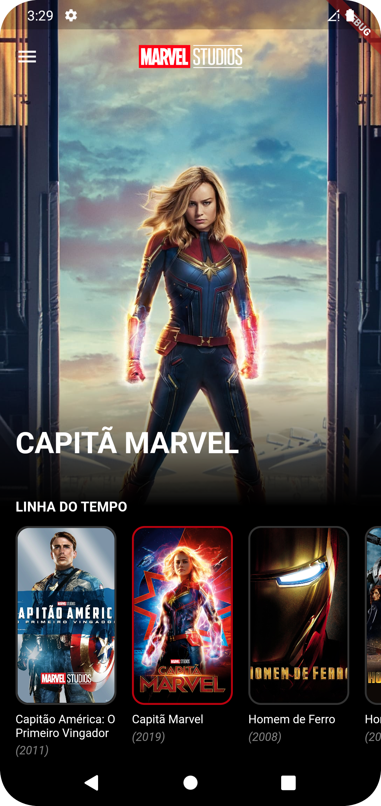

# MCU App
Esse é um app desenvolvido em flutter/dart que lista filmes do MCU

## ➕ Principais bibliotecas/tecnologias utilizadas
- Gerenciamento de estado: [Bloc](https://pub.dev/packages/bloc), [Flutter_bloc](https://pub.dev/packages/flutter_bloc)
- Injeção de dependências: [GetIt](https://pub.dev/packages/get_it)
- Requisições http: [Dio](https://pub.dev/packages/dio)
- Testes: [Mocktail](https://pub.dev/packages/mocktail), [bloc_test](https://pub.dev/packages/bloc_test)

## 📐 Arquitetura
Nesse projeto foi utilizada uma arquitetura limpa com Domain, Data e Presenter

## 🌐 API
Foi utilizado um mock da api da marvel: https://mocki.io/v1/246679d2-5063-466f-84ef-6157bf334da2

## 🔥 Build
Passo 1: [Instale o Flutter](https://docs.flutter.dev/get-started/install)
(Versão utilizada no desenvolvimento: 3.3.10)

Passo 2: Baixe ou clone este repositório usando o link abaixo:
```
https://github.com/GerlanStanley/mcu.git
```

Passo 3: Vá para a raiz do projeto e execute o seguinte comando no console para obter as dependências necessárias:
```
flutter pub get
```

Passo 4: Para executar o projeto realize o comando
```
flutter run
```

## ✅ Testes
Foram implementados testes de unidades, widgets e integração

Para executar os testes de unidade e widget realize o comando
```
flutter test
```

Para executar os testes de integração realize o comando
```
flutter test integration_test
```

## 🖼️ Screenshots
<p float="left">
    
     
</p>